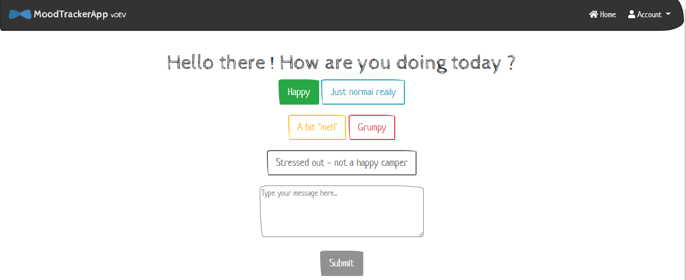

# moodTrackerApp



MoodTrackerApp captures the mood of the individual via a web page and stores it into one of these 5 categories:

- Happy
- Just normal really
- A bit “meh”
- Grumpy
- Stressed out – not a happy camper

MoodTrackerApp does not require any authentication. So the user is anonymous.
MoodTrackerApp stores information in Cookie and doesn't allow the user to submit twice in the same day. It doesn't allow the user to submit with a date that is not the current date.

## This application was generated using JHipster 7.6.0

As mentionned on [Jhipster](https://www.jhipster.tech/) website, it is a development platform to quickly generate, develop, and deploy modern web application.

- After installing Jhipster with `npm install -g generator-jhipster`
- Generate a fully functionnal web application with `jhipster`

## Technologies

- On the backend : Java, Spring Boot, Spring MVC, Spring Data, Spring Security
- On the frontend : Angular, Bootstrap

## How to build and run

- Make sure to install [Java](https://adoptopenjdk.net/), [Git](https://git-scm.com/) and [Node.js](https://nodejs.org/en/)
- Run the following command,

```
./mvnw
```

## Development

The major part of the code has been generated by JHipster.
The code added specifically for the moodtrack application can be located by searching

```
/*
 * @author lrasata
 */
```

This application was generated using JHipster 7.6.0, you can find documentation and help at [https://www.jhipster.tech/documentation-archive/v7.6.0](https://www.jhipster.tech/documentation-archive/v7.6.0).

### The following section is generated by JHipster for further information

### Project Structure

Node is required for generation and recommended for development. `package.json` is always generated for a better development experience with prettier, commit hooks, scripts and so on.

In the project root, JHipster generates configuration files for tools like git, prettier, eslint, husk, and others that are well known and you can find references in the web.

`/src/*` structure follows default Java structure.

- `.yo-rc.json` - Yeoman configuration file
  JHipster configuration is stored in this file at `generator-jhipster` key. You may find `generator-jhipster-*` for specific blueprints configuration.
- `.yo-resolve` (optional) - Yeoman conflict resolver
  Allows to use a specific action when conflicts are found skipping prompts for files that matches a pattern. Each line should match `[pattern] [action]` with pattern been a [Minimatch](https://github.com/isaacs/minimatch#minimatch) pattern and action been one of skip (default if ommited) or force. Lines starting with `#` are considered comments and are ignored.
- `.jhipster/*.json` - JHipster entity configuration files
- `npmw` - wrapper to use locally installed npm.
  JHipster installs Node and npm locally using the build tool by default. This wrapper makes sure npm is installed locally and uses it avoiding some differences different versions can cause. By using `./npmw` instead of the traditional `npm` you can configure a Node-less environment to develop or test your application.
- `/src/main/docker` - Docker configurations for the application and services that the application depends on

### Development

Before you can build this project, you must install and configure the following dependencies on your machine:

1. [Node.js][]: We use Node to run a development web server and build the project.
   Depending on your system, you can install Node either from source or as a pre-packaged bundle.

After installing Node, you should be able to run the following command to install development tools.
You will only need to run this command when dependencies change in [package.json](package.json).

```
npm install
```

We use npm scripts and [Angular CLI][] with [Webpack][] as our build system.

Run the following commands in two separate terminals to create a blissful development experience where your browser
auto-refreshes when files change on your hard drive.

```
./mvnw
npm start
```

Npm is also used to manage CSS and JavaScript dependencies used in this application. You can upgrade dependencies by
specifying a newer version in [package.json](package.json). You can also run `npm update` and `npm install` to manage dependencies.
Add the `help` flag on any command to see how you can use it. For example, `npm help update`.

The `npm run` command will list all of the scripts available to run for this project.

#### PWA Support

JHipster ships with PWA (Progressive Web App) support, and it's turned off by default. One of the main components of a PWA is a service worker.

The service worker initialization code is disabled by default. To enable it, uncomment the following code in `src/main/webapp/app/app.module.ts`:

```typescript
ServiceWorkerModule.register('ngsw-worker.js', { enabled: false }),
```

#### Managing dependencies

For example, to add [Leaflet][] library as a runtime dependency of your application, you would run following command:

```
npm install --save --save-exact leaflet
```

To benefit from TypeScript type definitions from [DefinitelyTyped][] repository in development, you would run following command:

```
npm install --save-dev --save-exact @types/leaflet
```

Then you would import the JS and CSS files specified in library's installation instructions so that [Webpack][] knows about them:
Edit [src/main/webapp/app/app.module.ts](src/main/webapp/app/app.module.ts) file:

```
import 'leaflet/dist/leaflet.js';
```

Edit [src/main/webapp/content/scss/vendor.scss](src/main/webapp/content/scss/vendor.scss) file:

```
@import '~leaflet/dist/leaflet.css';
```

Note: There are still a few other things remaining to do for Leaflet that we won't detail here.

For further instructions on how to develop with JHipster, have a look at [Using JHipster in development][].

#### Using Angular CLI

You can also use [Angular CLI][] to generate some custom client code.

For example, the following command:

```
ng generate component my-component
```

will generate few files:

```
create src/main/webapp/app/my-component/my-component.component.html
create src/main/webapp/app/my-component/my-component.component.ts
update src/main/webapp/app/app.module.ts
```

#### JHipster Control Center

JHipster Control Center can help you manage and control your application(s). You can start a local control center server (accessible on http://localhost:7419) with:

```
docker-compose -f src/main/docker/jhipster-control-center.yml up
```

### Building for production

#### Packaging as jar

To build the final jar and optimize the moodTrackerApp application for production, run:

```
./mvnw -Pprod clean verify
```

This will concatenate and minify the client CSS and JavaScript files. It will also modify `index.html` so it references these new files.
To ensure everything worked, run:

```
java -jar target/*.jar
```

Then navigate to [http://localhost:8080](http://localhost:8080) in your browser.

Refer to [Using JHipster in production][] for more details.

#### Packaging as war

To package your application as a war in order to deploy it to an application server, run:

```
./mvnw -Pprod,war clean verify
```

### Testing

To launch your application's tests, run:

```
./mvnw verify
```

#### Client tests

Unit tests are run by [Jest][]. They're located in [src/test/javascript/](src/test/javascript/) and can be run with:

```
npm test
```

For more information, refer to the [Running tests page][].
